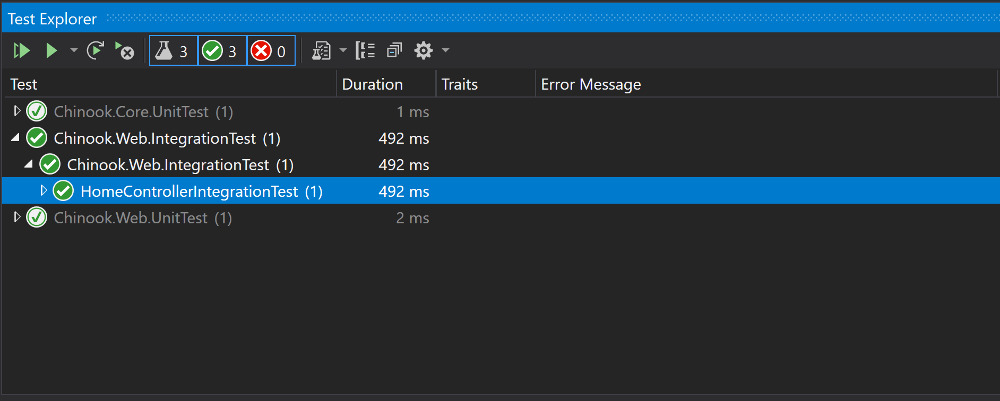

When the .NET Core team started to envision how the .NET Framework would look like as a modern web framework they set out to expand the testing capabilities of the framework. If you come from the world of [.NET MVC 5](https://docs.microsoft.com/en-us/aspnet/mvc/overview/getting-started/introduction/getting-started) you probably know that one of the best ways to test an HTTP request in MVC 5 was to use [Phil's HttpSimulator](https://haacked.com/archive/2007/06/19/unit-tests-web-code-without-a-web-server-using-httpsimulator.aspx/). 

That is no longer the case in .NET Core thanks to the power of the [WebApplicationFactory](https://docs.microsoft.com/en-us/dotnet/api/microsoft.aspnetcore.mvc.testing.webapplicationfactory-1?view=aspnetcore-5.0) class. This class creates a local instance of [TestServer](https://docs.microsoft.com/en-us/dotnet/api/microsoft.aspnetcore.testhost.testserver?view=aspnetcore-5.0), TestServer creates a local [kestrel](https://docs.microsoft.com/en-us/aspnet/core/fundamentals/servers/kestrel?view=aspnetcore-5.0) web server. Since we are dealing with an actual web server, not a fake web server, there is no need to stub, fake, or mock anything. The HTTP request that are made to the local kestrel web server are legitimate HTTP request, this gives you the power to test your application's functionality from visual studio, build server, or wherever you are executing your Unit Test as if the app where hosted on a live server.

Another neat feature of WebApplication factory is that it can create one or more instances of [HttpClient](https://docs.microsoft.com/en-us/dotnet/api/system.net.http.httpclient?view=net-5.0), that means that not only does WebApplicationFactory allow us to test our application from the server side but it also allows you to test clients. 

Imagine the following scenario, we want to test how our application handles conditional [HTTP GET request](https://developer.mozilla.org/en-US/docs/Web/HTTP/Conditional_requests), using  the WebApplicationFactory class, you would instantiate an HttpClient that would send an HTTP GET request to the kestrel server. The server responds to the request with 200 OK, in the response headers, an [ETag](https://developer.mozilla.org/en-US/docs/Web/HTTP/Headers/ETag) and [Last-Modified](https://developer.mozilla.org/en-US/docs/Web/HTTP/Headers/Last-Modified) are included. The HttpClient sends a second request to the kestrel server, in the request headers, [If-None-Match](https://developer.mozilla.org/en-US/docs/Web/HTTP/Headers/If-None-Match) and [If-Modified-Since](https://developer.mozilla.org/en-US/docs/Web/HTTP/Headers/If-Modified-Sinces) are included. The resource that was requested on the first GET request has not change, therefore, the server should return a [304 Not-Modify](https://developer.mozilla.org/en-US/docs/Web/HTTP/Status/304). If the resource has change sine the first request than a 200 OK should be return with the updated content and a new ETag. If the resource has not change but the ETag has expire then the server should return a 200 OK with no content (a conditional request) to signal the client that their cache version of the resource is still valid. All these scenarios can be part of an integration test suite in our project, all possible thanks to WebApplicationFactory. Having the power to test how a client and server interact with each other in single test is super useful and extremely powerful. It elevates our testing to a new levels, it gives us confidence that our application will work as expected once it has been deployed. 

For today's post I will show you how setup WebApplicationFactory to create integration tests. In a future post I will take the tests even further by leveraging SQLite as in-memory database, this will allow me to test the client, the API server and the database to ensure the data was persisted correctly. Please be aware that the database option may not work for you, it really depends on your use case. In .NET Core you can use the EF Core [in-memory provider](https://docs.microsoft.com/en-us/ef/core/providers/in-memory/?tabs=dotnet-core-cli) or an in-memory SQLite database if you are using SQLServer, MySQL or any other RDBMS. Personally, I recommend never using the in-memory provider. Jimmy Bogard [explains why](https://jimmybogard.com/avoid-in-memory-databases-for-tests/) on his blog.

To demonstrate the how WebApplicationFactory works I will create a new [XUnit](https://xunit.net/) Test project on my [Chinook](https://github.com/circleupx/Chinook) JSON:API project. The project will be called [Chinook.Web.IntegrationTest](https://github.com/circleupx/Chinook/tree/master/test/Chinook.Web.IntegrationTest) and it will be placed under the integration folder.

Now that we have a test project, I will create a CustomWebApplicationFactory class. This class will inherit from WebApplicationFactory. The purpose of the CustomWebApplicationFactory is to have a centralized location to add services, register [middlewares](https://docs.microsoft.com/en-us/aspnet/core/fundamentals/middleware/?view=aspnetcore-5.0), configure HttpClients, and override services registered on [StartUp](https://docs.microsoft.com/en-us/aspnet/core/fundamentals/startup?view=aspnetcore-5.0) class.

Before I go on, I will need to install a few NuGet packages on the Chinook.Web.IntegrationTest project.

```bash
dotnet add package Microsoft.AspNetCore.Mvc.Testing --version 5.0.1
```

This NuGet package is required to use the WebApplicationFactory.

```bash
dotnet add package FluentAssertions --version 5.10.3
```

I'm a huge fan of fluent style interfaces, fluent assertions is a great NuGet package for assertions.

Now that I have the required NuGet packages I will create the CustomApplicationFactory class. 

Here is the class definition for CustomWebApplicationFactory.

```c#
public class CustomWebApplicationFactory : WebApplicationFactory<Program>
{
    protected override IHostBuilder CreateHostBuilder()
    {
        var builder = base.CreateHostBuilder();
        return builder;
    }
}
```

Are you surprise by how simple the class looks? 

Well, that is only because my Chinook project has SQLite [already configured](https://github.com/circleupx/Chinook/blob/a4dc0d50be656709c4a3191da6fd4531ad2401fc/src/Chinook.Core/ChinookDbContext.cs#L35) as an in-memory database by reading a SQLite database file from the project directory. I would imagine that for most of you this is not the case, you are probably using some database hosted on a remote server and you've registered this dependency as a service on the StartUp class, probably like this.

```c#
public class StartUp
{
    // rest of the code omitted for brevity
    public void ConfigureServices(IServiceCollection services)
    {
        var connectionString = "REMOTE SERVER CONNECTION STRING";
        services.AddDbContext<YourDbContext>(options => options.UseSqlServer(connectionString));
    }
}
```

If you want to switch to SQLite as an in-memory database provider for your integration test, then you will need to override your [DbContext](https://docs.microsoft.com/en-us/dotnet/api/microsoft.extensions.dependencyinjection.entityframeworkservicecollectionextensions.adddbcontext?view=efcore-5.0) service, you can do so by overriding [ConfigureWebHost](https://docs.microsoft.com/en-us/dotnet/api/microsoft.aspnetcore.mvc.testing.webapplicationfactory-1.configurewebhost?view=aspnetcore-5.0#Microsoft_AspNetCore_Mvc_Testing_WebApplicationFactory_1_ConfigureWebHost_Microsoft_AspNetCore_Hosting_IWebHostBuilder_) as demonstrated on the following code.

```c#
class CustomWebApplicationFactory : WebApplicationFactory<Program>
{
    protected override void ConfigureWebHost(IWebHostBuilder builder)
    {
        builder.ConfigureServices(ConfigureServices);
    }

    private void ConfigureServices(WebHostBuilderContext webHostBuilderContext, IServiceCollection serviceCollection)
    {
        var dbContextService = serviceCollection.SingleOrDefault(d => d.ServiceType == typeof(DbContextOptions<ChinookDbContext>));
        if(dbContextService != null)
        {
            // remove the DbContext that is registered on StartUp.cs
            serviceCollection.Remove(dbContextService);
        }

        // register the new DbContext, .NET Core dependency injection framework will now use the this instance.
        var sqliteInMemoryConnectionString = new SqliteConnection("DataSource=:memory:");
        serviceCollection.AddDbContext<ChinookDbContext>(contextOptions => contextOptions.UseSqlite(sqliteInMemoryConnectionString));
    }
}
```

Now an in-memory SQLite database will be use instead of whatever DbContext you've registered on StartUp.cs, by the way, the code above will create an empty SQLite database, if you need to seed the database then you will need to access the DbContext, see the following code.

```c#
// rest of the code omitted for brevity
private void ConfigureServices(WebHostBuilderContext webHostBuilderContext, IServiceCollection serviceCollection)
{
    var dbContextService = serviceCollection.SingleOrDefault(d => d.ServiceType == typeof(DbContextOptions<ChinookDbContext>));
    if(dbContextService != null)
    {
        // remove the DbContext that is registered on StartUp.cs
        serviceCollection.Remove(dbContextService);
    }

    // register the new DbContext, .NET Core dependency injection framework will now use the in-memory SQLite instance instead of whatever configuration was used to register the DbContext on the StartUp class.
    var sqliteInMemoryConnectionString = new SqliteConnection("DataSource=:memory:");
    serviceCollection.AddDbContext<ChinookDbContext>(contextOptions => contextOptions.UseSqlite(sqliteInMemoryConnectionString));

    var builtServiceProvider = serviceCollection.BuildServiceProvider();
    using var scopedProvider = builtServiceProvider.CreateScope();

    var scopedServiceProvider = scopedProvider.ServiceProvider()

    // private field omitted for brevity
    _chinookDbContext = scopedServiceProvider.GetRequiredService<ChinookDbContext>();

    // these two lines are important, they ensure the in-memory database is created now.
    _chinookDbContext.Database.OpenConnection();
    _chinookDbContext.Database.EnsureCreated();

    // database is now ready to be seeded through the DbContext. The data will be available in each of your integration test due to the scope of the DbContext.
}
```

Anyways, back to our integration test. Our CustomApplicationFactory is ready, time to use it on a test. I will start by creating a test that instantiates an instance of HttpClient, the client will then send an HTTP GET request to the [Home resource](https://www.yunier.dev/2020-09-13-Restful-APIs-with-JSON-API-Specification/) of the API, the API should return a 200 OK.

Here is the class definition for HomeControllerIntegrationTest.

```c#
public class HomeControllerIntegrationTest : IClassFixture<CustomWebApplicationFactory>
{
    private readonly CustomWebApplicationFactory _customWebApplicationFactory;

    public HomeControllerIntegrationTest(CustomWebApplicationFactory customWebApplicationFactory)
    {
        _customWebApplicationFactory = customWebApplicationFactory;
    }

    [Fact]
    public async Task GetHomeResource_HttpResponse_ShouldReturn200OK()
    {
        // Arrange
        using var httpClient = _customWebApplicationFactory.CreateClient();
        var requestUri = httpClient.BaseAddress.AbsoluteUri;

        // Act
        var sut = await httpClient.GetAsync(requestUri);

        // Assert 
        var responseCode = sut.StatusCode;
        responseCode.Should().BeEquivalentTo(HttpStatusCode.OK);
    } 
}
```
Time to execute the test on Visual Studio.



As you can see the test passed when executed on visual studio. In less than half of a second, our integration test create a kestrel web server, it configured the server, it configure our API project, it made the API accessible through HTTP, it sent an HTTP request to the server, it received a 200 OK response and it validated the response. Awesome.

**Summary:** 

In this post I demonstrate how to build integration test using WebApplicationFactory. These test do not stub, mock or fake any data or http life cycle. The test are executed against a local kestrel web server, they run in memory and are very fast. These test allow you to validate your application's functionality as if it were deployed to a live server.