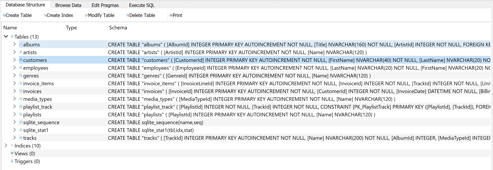
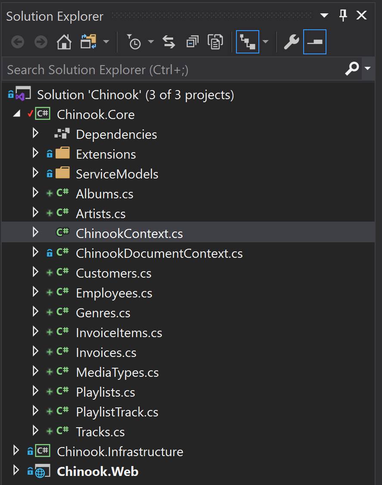
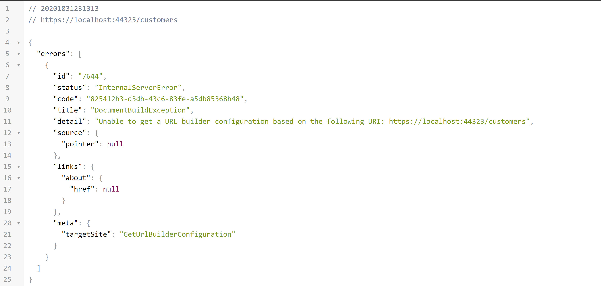

This will be my third blog post on [JSON:API](https://jsonapi.org/) in .NET Core. 

I plant to add **Customer** as an API resource, but before we get too deep on the code, I would like to review the [Chinook](https://www.sqlitetutorial.net/sqlite-sample-database/) database project. To do that I'm going to import [Chinook.db](https://cdn.sqlitetutorial.net/wp-content/uploads/2018/03/chinook.zip) into [DB Browser](https://sqlitebrowser.org/dl/) for SQLite to see all available entities.



As you can see we have quite a few entities, for this blog post I will concentrate on the **customers** entity. To accomplish adding customers as an API resource I will need to create a new service model that represents the customers entity in both JsonApiFramework and EF Core. I will scaffold the SQLite database using [EF Core's reverse engineering capabilities](https://docs.microsoft.com/en-us/ef/core/managing-schemas/scaffolding?tabs=dotnet-core-cli). 

For that, I'll open up a command line tool (windows terminal in my case) to execute the following commands.

```bash
dotnet tool install --global dotnet-ef
```

This installs EF Core as a global tool on the dotnet CLI. Verify your installation by running, 

```bash
dotnet ef
```

Next, I'll need to add the [Microsoft.EntityFrameworkCore.Design](https://www.nuget.org/packages/Microsoft.EntityFrameworkCore.Design/) NuGet package, the package will be install on the Chinook Core project.

```bash
dotnet add Chinook.Core package Microsoft.EntityFrameworkCore.Design
```

Additionally, I am going to need [Microsoft.EntityFrameworkCore.Sqlite](https://www.nuget.org/packages/Microsoft.EntityFrameworkCore.SQLite) to work with the database since our database is a SQLite database. It will also be installed on the Chinook.Core project.

```bash
dotnet add Chinook.Core package Microsoft.EntityFrameworkCore.Sqlite
```

Now I can run the ef scaffold command to generate entity models from the chinook database file.

```bash
dotnet ef dbcontext scaffold "DataSource=chinook.db" Microsoft.EntityFrameworkCore.Sqlite --project=Chinook.Core
```

Back on Visual Studio, if I expand the Chinook.Core project I can see that the entity models were successfully created.



Here is the EF Core database context generated by the scaffold tool.

```c#
public partial class ChinookContext : DbContext
{
    public chinookContext()
    {

    }

    public chinookContext(DbContextOptions<chinookContext> options): base(options)
    {

    }

    public virtual DbSet<Albums> Albums { get; set; }
    public virtual DbSet<Artists> Artists { get; set; }
    public virtual DbSet<Customers> Customers { get; set; }
    public virtual DbSet<Employees> Employees { get; set; }
    public virtual DbSet<Genres> Genres { get; set; }
    public virtual DbSet<InvoiceItems> InvoiceItems { get; set; }
    public virtual DbSet<Invoices> Invoices { get; set; }
    public virtual DbSet<MediaTypes> MediaTypes { get; set; }
    public virtual DbSet<PlaylistTrack> PlaylistTrack { get; set; }
    public virtual DbSet<Playlists> Playlists { get; set; }
    public virtual DbSet<Tracks> Tracks { get; set; }

    protected override void OnConfiguring(DbContextOptionsBuilder optionsBuilder)
    {
        if (!optionsBuilder.IsConfigured)
        {
            optionsBuilder.UseSqlite("DataSource=chinook.db");
        }
    }

    protected override void OnModelCreating(ModelBuilder modelBuilder)
    {
        modelBuilder.Entity<Albums>(entity =>
        {
            entity.HasKey(e => e.AlbumId);

            entity.ToTable("albums");

            entity.HasIndex(e => e.ArtistId)
                .HasName("IFK_AlbumArtistId");

            entity.Property(e => e.AlbumId).ValueGeneratedNever();

            entity.Property(e => e.Title)
                .IsRequired()
                .HasColumnType("NVARCHAR(160)");

            entity.HasOne(d => d.Artist)
                .WithMany(p => p.Albums)
                .HasForeignKey(d => d.ArtistId)
                .OnDelete(DeleteBehavior.ClientSetNull);
        });

        modelBuilder.Entity<Artists>(entity =>
        {
            entity.HasKey(e => e.ArtistId);

            entity.ToTable("artists");

            entity.Property(e => e.ArtistId).ValueGeneratedNever();

            entity.Property(e => e.Name).HasColumnType("NVARCHAR(120)");
        });

        modelBuilder.Entity<Customers>(entity =>
        {
            entity.HasKey(e => e.CustomerId);

            entity.ToTable("customers");

            entity.HasIndex(e => e.SupportRepId)
                .HasName("IFK_CustomerSupportRepId");

            entity.Property(e => e.CustomerId).ValueGeneratedNever();

            entity.Property(e => e.Address).HasColumnType("NVARCHAR(70)");

            entity.Property(e => e.City).HasColumnType("NVARCHAR(40)");

            entity.Property(e => e.Company).HasColumnType("NVARCHAR(80)");

            entity.Property(e => e.Country).HasColumnType("NVARCHAR(40)");

            entity.Property(e => e.Email)
                .IsRequired()
                .HasColumnType("NVARCHAR(60)");

            entity.Property(e => e.Fax).HasColumnType("NVARCHAR(24)");

            entity.Property(e => e.FirstName)
                .IsRequired()
                .HasColumnType("NVARCHAR(40)");

            entity.Property(e => e.LastName)
                .IsRequired()
                .HasColumnType("NVARCHAR(20)");

            entity.Property(e => e.Phone).HasColumnType("NVARCHAR(24)");

            entity.Property(e => e.PostalCode).HasColumnType("NVARCHAR(10)");

            entity.Property(e => e.State).HasColumnType("NVARCHAR(40)");

            entity.HasOne(d => d.SupportRep)
                .WithMany(p => p.Customers)
                .HasForeignKey(d => d.SupportRepId);
        });

        modelBuilder.Entity<Employees>(entity =>
        {
            entity.HasKey(e => e.EmployeeId);

            entity.ToTable("employees");

            entity.HasIndex(e => e.ReportsTo)
                .HasName("IFK_EmployeeReportsTo");

            entity.Property(e => e.EmployeeId).ValueGeneratedNever();

            entity.Property(e => e.Address).HasColumnType("NVARCHAR(70)");

            entity.Property(e => e.BirthDate).HasColumnType("DATETIME");

            entity.Property(e => e.City).HasColumnType("NVARCHAR(40)");

            entity.Property(e => e.Country).HasColumnType("NVARCHAR(40)");

            entity.Property(e => e.Email).HasColumnType("NVARCHAR(60)");

            entity.Property(e => e.Fax).HasColumnType("NVARCHAR(24)");

            entity.Property(e => e.FirstName)
                .IsRequired()
                .HasColumnType("NVARCHAR(20)");

            entity.Property(e => e.HireDate).HasColumnType("DATETIME");

            entity.Property(e => e.LastName)
                .IsRequired()
                .HasColumnType("NVARCHAR(20)");

            entity.Property(e => e.Phone).HasColumnType("NVARCHAR(24)");

            entity.Property(e => e.PostalCode).HasColumnType("NVARCHAR(10)");

            entity.Property(e => e.State).HasColumnType("NVARCHAR(40)");

            entity.Property(e => e.Title).HasColumnType("NVARCHAR(30)");

            entity.HasOne(d => d.ReportsToNavigation)
                .WithMany(p => p.InverseReportsToNavigation)
                .HasForeignKey(d => d.ReportsTo);
        });

        modelBuilder.Entity<Genres>(entity =>
        {
            entity.HasKey(e => e.GenreId);

            entity.ToTable("genres");

            entity.Property(e => e.GenreId).ValueGeneratedNever();

            entity.Property(e => e.Name).HasColumnType("NVARCHAR(120)");
        });

        modelBuilder.Entity<InvoiceItems>(entity =>
        {
            entity.HasKey(e => e.InvoiceLineId);

            entity.ToTable("invoice_items");

            entity.HasIndex(e => e.InvoiceId)
                .HasName("IFK_InvoiceLineInvoiceId");

            entity.HasIndex(e => e.TrackId)
                .HasName("IFK_InvoiceLineTrackId");

            entity.Property(e => e.InvoiceLineId).ValueGeneratedNever();

            entity.Property(e => e.UnitPrice)
                .IsRequired()
                .HasColumnType("NUMERIC(10,2)");

            entity.HasOne(d => d.Invoice)
                .WithMany(p => p.InvoiceItems)
                .HasForeignKey(d => d.InvoiceId)
                .OnDelete(DeleteBehavior.ClientSetNull);

            entity.HasOne(d => d.Track)
                .WithMany(p => p.InvoiceItems)
                .HasForeignKey(d => d.TrackId)
                .OnDelete(DeleteBehavior.ClientSetNull);
        });

        modelBuilder.Entity<Invoices>(entity =>
        {
            entity.HasKey(e => e.InvoiceId);

            entity.ToTable("invoices");

            entity.HasIndex(e => e.CustomerId)
                .HasName("IFK_InvoiceCustomerId");

            entity.Property(e => e.InvoiceId).ValueGeneratedNever();

            entity.Property(e => e.BillingAddress).HasColumnType("NVARCHAR(70)");

            entity.Property(e => e.BillingCity).HasColumnType("NVARCHAR(40)");

            entity.Property(e => e.BillingCountry).HasColumnType("NVARCHAR(40)");

            entity.Property(e => e.BillingPostalCode).HasColumnType("NVARCHAR(10)");

            entity.Property(e => e.BillingState).HasColumnType("NVARCHAR(40)");

            entity.Property(e => e.InvoiceDate)
                .IsRequired()
                .HasColumnType("DATETIME");

            entity.Property(e => e.Total)
                .IsRequired()
                .HasColumnType("NUMERIC(10,2)");

            entity.HasOne(d => d.Customer)
                .WithMany(p => p.Invoices)
                .HasForeignKey(d => d.CustomerId)
                .OnDelete(DeleteBehavior.ClientSetNull);
        });

        modelBuilder.Entity<MediaTypes>(entity =>
        {
            entity.HasKey(e => e.MediaTypeId);

            entity.ToTable("media_types");

            entity.Property(e => e.MediaTypeId).ValueGeneratedNever();

            entity.Property(e => e.Name).HasColumnType("NVARCHAR(120)");
        });

        modelBuilder.Entity<PlaylistTrack>(entity =>
        {
            entity.HasKey(e => new { e.PlaylistId, e.TrackId });

            entity.ToTable("playlist_track");

            entity.HasIndex(e => e.TrackId)
                .HasName("IFK_PlaylistTrackTrackId");

            entity.HasOne(d => d.Playlist)
                .WithMany(p => p.PlaylistTrack)
                .HasForeignKey(d => d.PlaylistId)
                .OnDelete(DeleteBehavior.ClientSetNull);

            entity.HasOne(d => d.Track)
                .WithMany(p => p.PlaylistTrack)
                .HasForeignKey(d => d.TrackId)
                .OnDelete(DeleteBehavior.ClientSetNull);
        });

        modelBuilder.Entity<Playlists>(entity =>
        {
            entity.HasKey(e => e.PlaylistId);

            entity.ToTable("playlists");

            entity.Property(e => e.PlaylistId).ValueGeneratedNever();

            entity.Property(e => e.Name).HasColumnType("NVARCHAR(120)");
        });

        modelBuilder.Entity<Tracks>(entity =>
        {
            entity.HasKey(e => e.TrackId);

            entity.ToTable("tracks");

            entity.HasIndex(e => e.AlbumId)
                .HasName("IFK_TrackAlbumId");

            entity.HasIndex(e => e.GenreId)
                .HasName("IFK_TrackGenreId");

            entity.HasIndex(e => e.MediaTypeId)
                .HasName("IFK_TrackMediaTypeId");

            entity.Property(e => e.TrackId).ValueGeneratedNever();

            entity.Property(e => e.Composer).HasColumnType("NVARCHAR(220)");

            entity.Property(e => e.Name)
                .IsRequired()
                .HasColumnType("NVARCHAR(200)");

            entity.Property(e => e.UnitPrice)
                .IsRequired()
                .HasColumnType("NUMERIC(10,2)");

            entity.HasOne(d => d.Album)
                .WithMany(p => p.Tracks)
                .HasForeignKey(d => d.AlbumId);

            entity.HasOne(d => d.Genre)
                .WithMany(p => p.Tracks)
                .HasForeignKey(d => d.GenreId);

            entity.HasOne(d => d.MediaType)
                .WithMany(p => p.Tracks)
                .HasForeignKey(d => d.MediaTypeId)
                .OnDelete(DeleteBehavior.ClientSetNull);
        });

        OnModelCreatingPartial(modelBuilder);
    }

    partial void OnModelCreatingPartial(ModelBuilder modelBuilder);
```
On a future blog post, I will come back to clean this up a bit more, I prefer having an EntityConfiguration class per entity rather than having everything define in the DbContext, but for now this will do. 

```c#
public partial class Customers
{
    public Customers()
    {
        Invoices = new HashSet<Invoices>();
    }

    public long CustomerId { get; set; }
    public string FirstName { get; set; }
    public string LastName { get; set; }
    public string Company { get; set; }
    public string Address { get; set; }
    public string City { get; set; }
    public string State { get; set; }
    public string Country { get; set; }
    public string PostalCode { get; set; }
    public string Phone { get; set; }
    public string Fax { get; set; }
    public string Email { get; set; }
    public long? SupportRepId { get; set; }

    public virtual Employees SupportRep { get; set; }
    public virtual ICollection<Invoices> Invoices { get; set; }
}
```
This is the Customer model class that was generated using the scaffold tool. Let me clean up the project a little by moving all models that were generated by the scaffold to be under the ServiceModel folder, the namespace will be updated accordingly.

Our next task will be to configure JsonApiFramework to work with our new entities by adding a ResourceConfiguration class for our Customer service model.

```c#
class CustomerServiceModelConfiguration : ResourceTypeBuilder<Customers>
{

}
```

Simple, nothing complicated, next we need to update the HomeResource class. The home resource will now need to expose a link to the customers resource. That be accomplished by modifying our HomeResource class like this,

```c#
public class HomeResource
{
    private readonly IHttpContextAccessor httpContextAccessor;
    private readonly ILogger<HomeResource> logger;

    public HomeResource(IHttpContextAccessor httpContextAccessor, ILogger<HomeResource> logger)
    {
        this.httpContextAccessor = httpContextAccessor;
        this.logger = logger;
    }

    public Task<Document> GetHomeDocument()
    {
        var homeResource = new HomeServiceModel
        {
            Message = "Hello World"
        };

        var currentRequestUri = httpContextAccessor.HttpContext.GetCurrentRequestUri();

        var scheme = currentRequestUri.Scheme;
        var host = currentRequestUri.Host;
        var port = currentRequestUri.Port;
        var urlBuilderConfiguration = new UrlBuilderConfiguration(scheme, host, port);
        var customersResourceCollectionLink = CreateCustomerResourceCollectionLink(urlBuilderConfiguration);

        using var chinookDocumentContext = new ChinookDocumentContext(currentRequestUri);
        var document = chinookDocumentContext
                    .NewDocument(currentRequestUri)
                        .SetJsonApiVersion(JsonApiVersion.Version10)
                        .Links()
                            .AddSelfLink()
                        .LinksEnd()
                        .Resource(homeResource)
                            .Links()
                                .AddLink(CustomerResourceKeyWords.Self, customersResourceCollectionLink)
                                .LinksEnd()
                        .ResourceEnd()
                    .WriteDocument();

        return Task.FromResult(document);
    }

    private Link CreateCustomerResourceCollectionLink(UrlBuilderConfiguration urlBuilderConfiguration)
    {
        var customersResourceCollectionLink = UrlBuilder.Create(urlBuilderConfiguration)
                                                    .Path(CustomerResourceKeyWords.Self)
                                                    .Build();
        
        return new Link(customersResourceCollectionLink);
    }
}
```
Let's review the changes I just made, the first change made was to call GetCurrentRequestUri(), this is a new method that exist within the HttpContextExtensions class. Here is the class definition.

```c#
public static class HttpContextExtensions
{
    public static Uri GetCurrentRequestUri(this HttpContext httpContext)
    {
        var currentRequest = httpContext.Request;

        var currentRequestUriBuilder = new UriBuilder
        {
            Scheme = currentRequest.Scheme,
            Host = currentRequest.Host.Host,
            Port = currentRequest.Host.Port.GetValueOrDefault(),
            Path = currentRequest.Path.Value
        };

        var currentRequestUri = currentRequestUriBuilder.Uri;
        return currentRequestUri;
    }
}
```
The second change I made was to create a private method within the HomeResource class called CreateCustomerResourceCollectionLink, this method utilizes the UrlBuilder class from JsonApiFramework to build a JSON:API [Link](https://jsonapi.org/format/#document-links).

Now if I run the project the home resource should expose a link to the customers API resource.

```json
{
  "jsonapi": {
    "version": "1.0"
  },
  "links": {
    "self": "https://localhost:44323"
  },
  "data": {
    "type": "home",
    "id": null,
    "attributes": {
      "message": "Chinook Sample JSON:API Project"
    },
    "links": {
      "customers": "https://localhost:44323/customers"
    }
  }
}
```

If you click the link you will get HTTP 404 error as we haven't added any controllers that can handle that HTTP request. 

Let's change that.

I'll start by adding a new controller, CustomerController. This will handle routing for the customer resource, as well as any relationships exposed to other resources.

```c#
[ApiController]
public class CustomerController : ControllerBase
{
    private readonly ILogger<CustomerController> _logger;
    private readonly ChinookContext _chinookContext;
    private readonly IHttpContextAccessor _httpContextAccessor;

    public CustomerController(ILogger<CustomerController> logger, ChinookContext chinookContext, IHttpContextAccessor httpContextAccessor)
    {
        _logger = logger;
        _chinookContext = chinookContext;
        _httpContextAccessor = httpContextAccessor;
    }

    [Route(CustomerResourceKeyWords.Self)]
    public async Task<IActionResult> GetCustomersResourceCollection()
    {
        var customerResourceCollection = await _chinookContext.Customers.ToListAsync();
        var currentRequestUri = _httpContextAccessor.HttpContext.GetCurrentRequestUri();

        using var chinookDocumentContext = new ChinookDocumentContext();
        var document = chinookDocumentContext
            .NewDocument(currentRequestUri)
            .SetJsonApiVersion(JsonApiVersion.Version10)
                .Links()
                    .AddUpLink()
                    .AddSelfLink()
                .LinksEnd()
                .ResourceCollection(customerResourceCollection)
                    .Links()
                        .AddSelfLink()
                    .LinksEnd()
                .ResourceCollectionEnd()
            .WriteDocument();

        return Ok(document);
    }
}
```
Controller has been added. 

Don't forget to register ChinookContext on the built-int dependency injection framework.

```c#
public void ConfigureServices(IServiceCollection services)
{
    services.AddTransient<HomeResource>();
    services.AddDbContext<ChinookContext>();  // DbContext added as a dependency.
    services.AddHttpContextAccessor();
    services.AddControllers()
        .AddNewtonsoftJson();
}
```

and I know, I can hear you saying **'Doesn't accessing the DbContext directly on the controller violate the Clean Architecture project structure?'**. It does, but for right now I am not concerned about that, I don't want to spend too much time on the Data layer at this point. I want to keep it simple by accessing the DbContext directly. In a future blog post, I will return to clean this all up. For now I want to get the resource up and running.

Time to run the project again. Clicking on the customer link on the home resource gets me the following JSON:API errors documents as the HTTP response.



The error did not make any sense at first, but then it clicked. We created a CustomerServiceModelConfiguration class so that JsonApiFramework understands how to work the CustomersServiceModel class but we never registered it on our ConfigurationFactory class. Let's change that.

```c#
 public static IServiceModel CreateServiceModel()
{
    var serviceModelBuilder = new ServiceModelBuilder();
    serviceModelBuilder.Configurations.Add(new HomeServiceModelConfiguration());
    serviceModelBuilder.Configurations.Add(new CustomerServiceModelConfiguration());
    serviceModelBuilder.HomeResource<HomeServiceModel>();

    var createConventions = CreateConventions();
    var serviceModel = serviceModelBuilder.Create(createConventions);
    return serviceModel;
}
```

Here is the updated CreateServiceModel method in our ConfigurationFactory class. As you can see, the CustomerServiceModelConfiguration class is now registered. When I run the project now I get the following runtime exception,

```json
{
  "errors": [
    {
      "id": "1312",
      "status": "InternalServerError",
      "code": "0380bf13-8d15-4bf5-9367-170af0bb7d95",
      "title": "ServiceModelException",
      "detail": "ServiceModel has missing ResourceType [clrType=Customer] metadata. Ensure metadata is configured correctly for the respective domain/schema.",
      "source": {
        "pointer": null
      },
      "links": {
        "about": {
          "href": null
        }
      },
      "meta": {
        "targetSite": "GetResourceType"
      }
    }
  ]
}
```

JsonApiFramework is not able to determine which property within the Customers class should be used as the JSON:API [identifier](https://jsonapi.org/format/#document-resource-object-identification). JsonApiFramework offers two solutions to this problem. We can use the built-in conventions offered by JsonApiFramework. This is similar to how EF and EF Core Fluent APIs work, if you have a class named Dog and that class has a public property named Id or DogId, JsonApiFramework understands that this property is the entity identifier so it automatically maps it as the JSON:API identifier on your JSON:API document. In our case, our class is named Customers, plural, and the entity identifier is the public property CustomerId, **notice that word Customer in CustomerId is singular**. This naming mismatched is due to the EF scaffold tool. 

So, if I refactor my code by renaming the Customers (plural) class to Customer (singular) then the API returns the following JSON:API Document.

```json
{
  "jsonapi": {
    "version": "1.0"
  },
  "links": {
    "self": "https://localhost:44323/customers",
    "up": "https://localhost:44323"
  },
  "data": [
    {
      "type": "customers",
      "id": "1",
      "attributes": {
        "firstName": "Luís",
        "lastName": "Gonçalves",
        "company": "Embraer - Empresa Brasileira de Aeronáutica S.A.",
        "address": "Av. Brigadeiro Faria Lima, 2170",
        "city": "São José dos Campos",
        "state": "SP",
        "country": "Brazil",
        "postalCode": "12227-000",
        "phone": "+55 (12) 3923-5555",
        "fax": "+55 (12) 3923-5566",
        "email": "luisg@embraer.com.br"
      },
      "links": {
        "self": "https://localhost:44323/customers/1"
      }
    },
    {
      "type": "customers",
      "id": "2",
      "attributes": {
        "firstName": "Leonie",
        "lastName": "Köhler",
        "company": null,
        "address": "Theodor-Heuss-Straße 34",
        "city": "Stuttgart",
        "state": null,
        "country": "Germany",
        "postalCode": "70174",
        "phone": "+49 0711 2842222",
        "fax": null,
        "email": "leonekohler@surfeu.de"
      },
      "links": {
        "self": "https://localhost:44323/customers/2"
      }
    }
  ]
}

```

The second approach is to use configurations by configuring our CustomerServiceModelConfiguration class. I'll undo my refactoring, the customers class is back to being plural and I'll update the CustomerServiceModelConfiguration class.

```c#
class CustomerServiceModelConfiguration : ResourceTypeBuilder<Customers>
{
    public CustomerServiceModelConfiguration()
    {
        ResourceIdentity(nameof(Customers.CustomerId), typeof(long));
    }
}
```

Simply call the method ResourceIdentity, use the **nameof** and **typeof** parameter to let JsonApiFramework know what the entity identifier is for the service model.

If I run the Web Api project again. I get the same JSON:API document as an HTTP response.

```json
{
  "jsonapi": {
    "version": "1.0"
  },
  "links": {
    "self": "https://localhost:44323/customers",
    "up": "https://localhost:44323"
  },
  "data": [
    {
      "type": "customers",
      "id": "1",
      "attributes": {
        "firstName": "Luís",
        "lastName": "Gonçalves",
        "company": "Embraer - Empresa Brasileira de Aeronáutica S.A.",
        "address": "Av. Brigadeiro Faria Lima, 2170",
        "city": "São José dos Campos",
        "state": "SP",
        "country": "Brazil",
        "postalCode": "12227-000",
        "phone": "+55 (12) 3923-5555",
        "fax": "+55 (12) 3923-5566",
        "email": "luisg@embraer.com.br"
      },
      "links": {
        "self": "https://localhost:44323/customers/1"
      }
    },
    {
      "type": "customers",
      "id": "2",
      "attributes": {
        "firstName": "Leonie",
        "lastName": "Köhler",
        "company": null,
        "address": "Theodor-Heuss-Straße 34",
        "city": "Stuttgart",
        "state": null,
        "country": "Germany",
        "postalCode": "70174",
        "phone": "+49 0711 2842222",
        "fax": null,
        "email": "leonekohler@surfeu.de"
      },
      "links": {
        "self": "https://localhost:44323/customers/2"
      }
    }
  ]
}

```

The API now successfully exposes Customer as an API resource. By the next blog post, I will add the remaining resources.