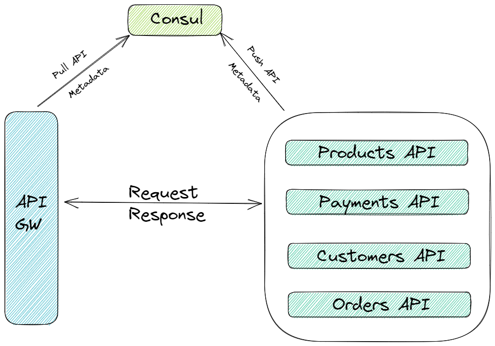
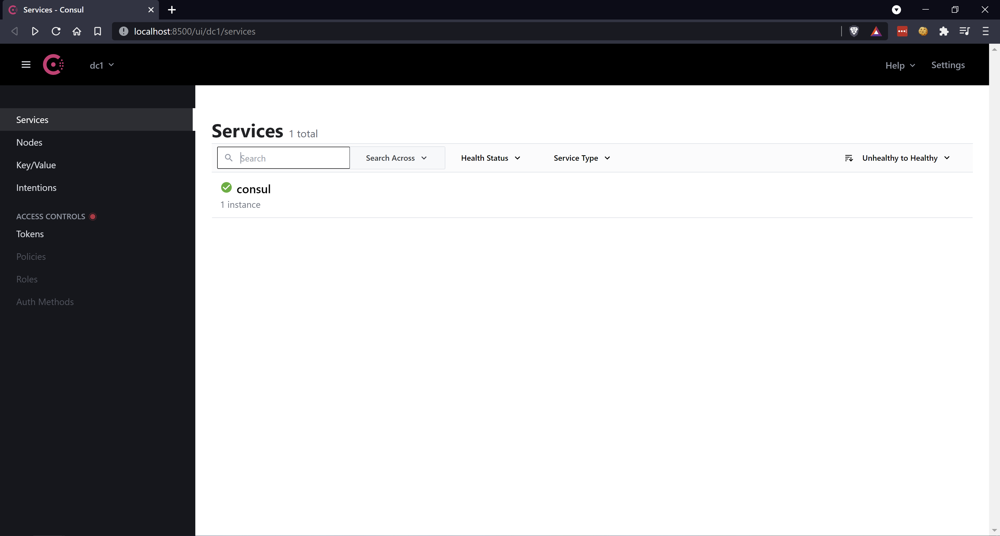

## Intro
At one of my previous job, the team there implemented a hypermedia driven api that followed the [JSON:API](https://jsonapi.org/) specification. The API was a monolith, it handled all business logic, transactions and workflows. When the time came to talk about possibly switching to a microservice oriented architecture, an idea emerged, to use hypermedia to stitch up the different microservices, the same idea that led to the world wide web become such a successful distributed hypermedia system. 

Unfortunately, the team was never ever to complete the implementation. Lately, I've seen some chatter on twitter on hypermedia driven APIs that includes using hypermedia to stitch up multiple APIs.

<blockquote class="twitter-tweet"><p lang="en" dir="ltr"><a href="https://twitter.com/hashtag/hypermedia?src=hash&amp;ref_src=twsrc%5Etfw">#hypermedia</a> <a href="https://twitter.com/hashtag/API?src=hash&amp;ref_src=twsrc%5Etfw">#API</a> people out there: have you talked about or heard someone talk about &quot;intra-API&quot; links and &quot;inter-API&quot; links? just wondering if that perspective might be useful as a way to highlight one possible advantage of hypermedia: providing seamless <a href="https://twitter.com/hashtag/DX?src=hash&amp;ref_src=twsrc%5Etfw">#DX</a> in API landscapes.</p>&mdash; Erik Wilde (@dret) <a href="https://twitter.com/dret/status/1388871515136012291?ref_src=twsrc%5Etfw">May 2, 2021</a></blockquote> <script async src="https://platform.twitter.com/widgets.js" charset="utf-8"></script>

For a while now I've been meaning to build a hypermedia driven microservice proof of concept to understand the possible benefits and drawbacks of such systems. To build a hypermedia driven microservice architecture, a few problems will need to be solved. They are as follows.

1. Service Discovery - APIs need to be able to locate other APIs.
2. Linkable - Each API should be able to build link to resources that are located in other APIs.
3. Service abstraction - Client should only known of one endpoint, the entrypoint also known as the [Home](https://apievangelist.com/2017/08/03/api-discovery-using-json-home/) resource, also known as the [API Gateway pattern](https://freecontent.manning.com/the-api-gateway-pattern/).

To solve the first problem, I need the APIs to be somewhat aware of each other. For that I will need a service discovery tool. To me, HashiCorp's [Consul](https://www.hashicorp.com/products/consul) is the perfect tool to use for service discovery. Each API can be registered with Consul on boot up, once the registration has been completed, the API would then be accessible externally through the [Home resource](https://apievangelist.com/2017/08/03/api-discovery-using-json-home/).

The second problem deals with being able to built links to resource that expand across multiple APIs. For that I will rely upon the framework JsonApiFramework, which will also be the framework that will take our C# service object and serialize them into [JSON:API](https://jsonapi.org/) [documents](https://jsonapi.org/format/#document-structure).

The third proble, service abstraction, will be solved by creating an API gateway, this gateway will expose one resource, the [home resource](https://apievangelist.com/2017/08/03/api-discovery-using-json-home/).

Now I just need to decide on what microservices to built. I know the first microservice, it will be the home resource, the other microservices will depend upon what kind of system I am building. I think I should keep thing simple and built something most of us are familiar with, an e-commerce system. In e-commerce application, you will typically have customers, orders, products and payments. I think those are good starting points, so I am going to build microservices for each. The architecture so far would like the following diagram.

## Reference Architecture


## Installing Consul

You can install Consul on your machine by downloading the binary package directly from the [official Consul website](https://www.consul.io/downloads). Once you have the binary, you will need to update your PATH or execute Consul by providing the full path to the binary. See [this](https://learn.hashicorp.com/tutorials/consul/get-started-install?in=consul/getting-started#install-consul) page for more details.

To verify the installation was successful run the following command.

```console 
consul
```

If the installation was done successfully then the command above should output something similar to this following text.

```console
$ consul
Usage: consul [--version] [--help] <command> [<args>]

Available commands are:
    acl            Interact with Consul's ACLs
    agent          Runs a Consul agent
    catalog        Interact with the catalog
    config         Interact with Consul's Centralized Configurations
    connect        Interact with Consul Connect
    debug          Records a debugging archive for operators
    event          Fire a new event
    exec           Executes a command on Consul nodes
    force-leave    Forces a member of the cluster to enter the "left" state
    info           Provides debugging information for operators.
    intention      Interact with Connect service intentions
    join           Tell Consul agent to join cluster
    keygen         Generates a new encryption key
    keyring        Manages gossip layer encryption keys
    kv             Interact with the key-value store
    leave          Gracefully leaves the Consul cluster and shuts down
    lock           Execute a command holding a lock
    login          Login to Consul using an auth method
    logout         Destroy a Consul token created with login
    maint          Controls node or service maintenance mode
    members        Lists the members of a Consul cluster
    monitor        Stream logs from a Consul agent
    operator       Provides cluster-level tools for Consul operators
    reload         Triggers the agent to reload configuration files
    rtt            Estimates network round trip time between nodes
    services       Interact with services
    snapshot       Saves, restores and inspects snapshots of Consul server state
    tls            Builtin helpers for creating CAs and certificates
    validate       Validate config files/directories
    version        Prints the Consul version
    watch          Watch for changes in Consul
```

To initialize the consul agent locally, run the following command.

```console
consul agent -dev
```

> TIP: Never inialize the agent with the -dev command arguement for production.

Consul those come with a UI interface, you can access the UI interface by appending -ui to the command above.

```console
consul agent -dev -ui
```

You should now be able to access the UI interface on the default 8500 port. 



Consul comes with an [HTTP API](https://www.consul.io/api-docs), it can be access on the same 8500 port. The API will be what the microservices will use to add new services or query for existing services. For example, the home microservice could query the Consul API periodically to get a list of active services. The other microservices would register themselves with the Consul API on application start.

To register and query Consul I will rely upon the [.NET Consul SDK](https://github.com/G-Research/consuldotnet), for SDKs available in other languages, see [this](https://www.consul.io/api-docs/libraries-and-sdks) page.

## The home microservice

The first microservice, the home API, will act as an API Gateway. It will be the entry point to the entire system. I've spoken about this [before](../../2020/json-api-creating-the-home-resource), the idea is that like website, an API should have a home, a top level resource that helps clients discover other resources. The API will query Consul to retrieve metadata information about other service i.e. their URI.

## The customer microservice